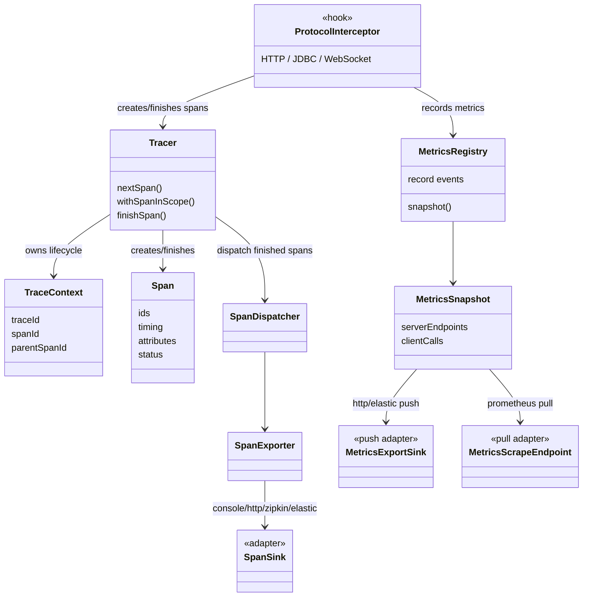

# Mini Distributed Observability

Thư viện Java mini cung cấp observability cho ứng dụng Java với mục tiêu **ít hoặc không cần sửa code nghiệp vụ**. Project tập trung vào ba phần chính: tự động intercept giao tiếp, tạo trace context xuyên suốt request flow, gom metrics nội bộ, rồi xuất dữ liệu ra nhiều backend khác nhau bằng adapter riêng.

Đây không phải một bản thay thế OpenTelemetry/Brave hoàn chỉnh. Mục tiêu của project là chứng minh hướng thiết kế đúng cho đề bài: core độc lập, dữ liệu có cấu trúc, có correlation giữa các service, và có thể nối ra nhiều hệ quan sát khác nhau mà không khóa chặt vào một backend.

## Phạm Vi Đề Bài

- HTTP inbound/outbound: Servlet filter và RestTemplate interceptor.
- Stateful protocol: WebSocket/STOMP qua handshake, channel interceptor và session events.
- Database: JDBC qua datasource-proxy.
- Trace context: tự sinh trace/span id, propagate qua HTTP header, WebSocket/STOMP metadata và thread context.
- Metrics: request/call count, latency percentile, error, in-flight, active connection, throughput bytes, slow request, consecutive failure.
- Output: console, HTTP receiver, Zipkin, Prometheus scrape, Elasticsearch/Kibana.

## Kiến Trúc Tổng Quan

## Hook Và Adapter

Các hook nằm ở biên giao tiếp của ứng dụng:

- `TracingFilter`: nhận HTTP inbound, extract trace context, tạo server span.
- `TracingClientInterceptor`: chặn HTTP outbound, inject trace context.
- `JdbcTracingDataSource`: bọc JDBC call để ghi span và metrics database.
- `StompTracingChannelInterceptor`: tạo span theo từng STOMP message.
- `WebSocketSessionMetricsListener`: đếm active WebSocket connections bằng session lifecycle.

Các adapter xuất dữ liệu tách khỏi core:

- Span: console, HTTP receiver, Zipkin, Elasticsearch.
- Metrics: HTTP receiver, Elasticsearch push, Prometheus pull endpoint.

Nhờ vậy core không phụ thuộc Prometheus, Zipkin, ELK hay UI tự viết.

## Các Kiểu Output

Project đang có vài kiểu output chính:

- **Console sink**: ghi JSON ra console, phù hợp để debug nhanh.
- **HTTP push sink**: thư viện chủ động gửi `SpanExport` hoặc `MetricsExport` sang receiver tự viết.
- **Backend-specific sink**: sink tự đổi format theo backend, ví dụ Zipkin nhận span format riêng, Elasticsearch nhận NDJSON qua Bulk API.
- **Pull endpoint**: dùng cho Prometheus, app mở `/metrics` để Prometheus scrape thay vì thư viện tự push.
- **Receiver UI demo**: server riêng nhận dữ liệu JSON và hiển thị trực quan, dùng để chứng minh output độc lập với backend monitoring cụ thể.

Điểm quan trọng là sink/endpoint chỉ là lớp ngoài. Core không cần biết dữ liệu cuối cùng đi vào Zipkin, Prometheus, ELK hay UI tự viết.

## Điểm Mạnh

- Vai trò tương đối rõ: interceptor thu thập, tracer quản lý span lifecycle, registry giữ metrics, sink/endpoint lo xuất dữ liệu.
- Trace và metrics độc lập nhưng cùng dùng dữ liệu từ request flow.
- Có cross-service propagation qua nhiều service demo A -> B -> C.
- Output không bị khóa vào một backend: có thể xem bằng receiver UI, Zipkin, Prometheus/Grafana hoặc Elasticsearch/Kibana.
- Thiết kế đủ nhỏ gọn để đọc và giải thích trong phạm vi mini project.

## Đánh Đổi

- Chưa có retry phức tạp, auth backend, index template, sampling nâng cao hay xử lý concurrency đầy đủ.
- Metrics hiện là snapshot nội bộ, không phải data model đầy đủ như OpenTelemetry Metrics.
- Trace UI/analysis nâng cao vẫn nên để backend chuyên dụng như Zipkin hoặc hệ ELK đảm nhiệm.
- Một số interceptor mới dừng ở case demo phổ biến trên Spring Boot, chưa bao phủ toàn bộ framework Java.
- Các sink hiện ưu tiên dễ đọc: chưa parse lỗi chi tiết từng item trong bulk response, chưa có backpressure/requeue phức tạp, chưa có schema migration cho backend.
- Prometheus endpoint chỉ expose text format từ dữ liệu đang có; latency percentile là gauge, chưa phải histogram chuẩn vì core chưa expose bucket/count/sum.

## Kết Luận

Project đang đi theo hướng phù hợp với đề bài: **core observability độc lập**, dữ liệu có cấu trúc, có trace correlation xuyên service, có metrics tự gom, và có nhiều adapter xuất dữ liệu. Phần cố ý giữ đơn giản nằm ở các chi tiết production như retry, security, schema template, xử lý và tối ưu concurrency.
