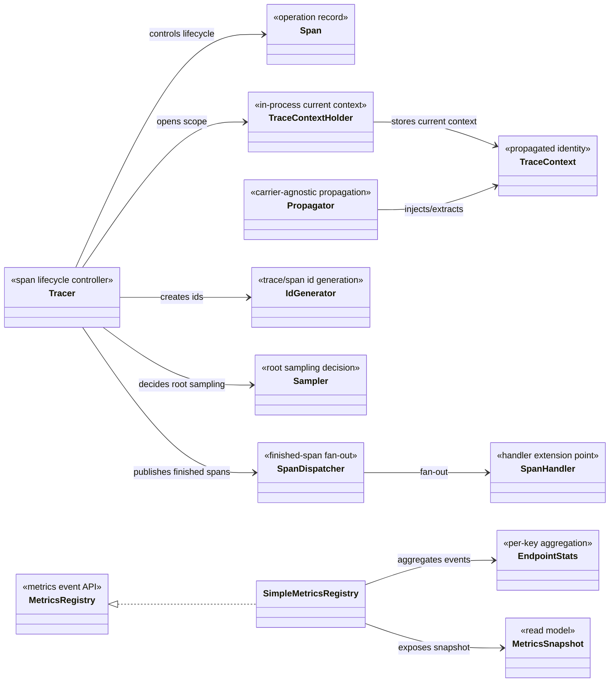
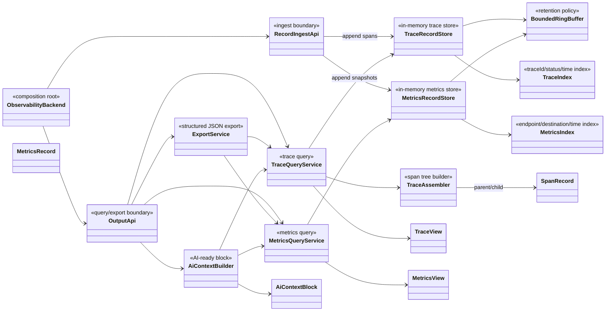
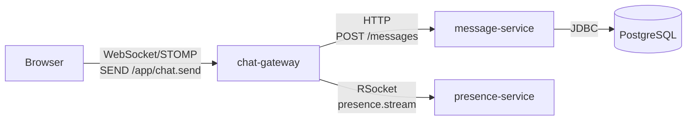
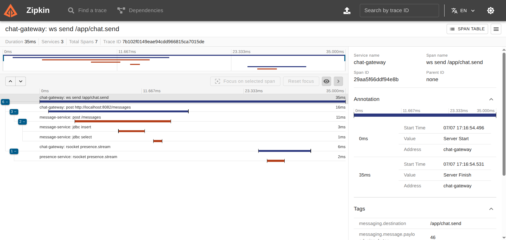
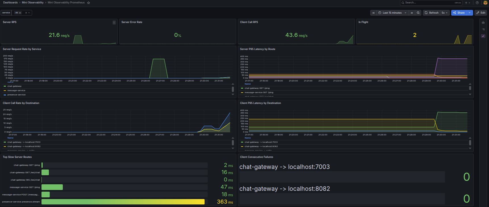

# Mini Distributed Observability — Báo cáo kỹ thuật

*Thư viện observability phân tán tối giản cho ứng dụng Java, kèm backend observability tự xây dựng*

---

## Lời mở đầu

Trong các hệ thống phân tán, một request của người dùng thường đi qua nhiều thành phần: gateway WebSocket, service HTTP, truy vấn database, và các service nội bộ giao tiếp bằng nhiều giao thức khác nhau. Khi có sự cố (chậm, lỗi), việc lần theo một request xuyên suốt các chặng gọi rất khó nếu mỗi service chỉ ghi log rời rạc. Đây là lý do ra đời của *distributed tracing* và *metrics aggregation* — nền tảng của observability cho hệ phân tán.

Báo cáo trình bày thiết kế và hiện thực **Mini Distributed Observability** — một thư viện Java tự thu thập trace và metrics ở biên giao tiếp của ứng dụng, nối các chặng gọi thành một *trace* thống nhất, gom metrics, và xuất dữ liệu ra nhiều backend khác nhau mà không phụ thuộc một backend cụ thể. Ngoài khả năng nối ra các backend chuẩn (Zipkin, Prometheus, Elasticsearch), hệ thống có **một backend observability riêng** cung cấp API truy vấn trace/metrics và một **AI context block** phục vụ phân tích bằng AI. Mục tiêu không phải thay thế OpenTelemetry hay Brave, mà trình bày một hướng thiết kế: core độc lập, dữ liệu có cấu trúc, có correlation xuyên service kể cả khác giao thức, và Output không khóa vào backend.

## Tóm tắt nội dung và đóng góp

Thư viện thu thập observability **không cần sửa code nghiệp vụ**, thông qua các *interceptor* cắm vào bốn giao thức: HTTP (inbound/outbound), WebSocket/STOMP, JDBC và RSocket. Mỗi chặng gọi được ghi thành một *span* mang `traceId/spanId/parentSpanId`; trace context được truyền xuyên service theo chuẩn W3C `traceparent` (qua HTTP header, STOMP native header, RSocket composite metadata), nhờ đó **cùng một `traceId` liên kết toàn bộ chuỗi gọi kể cả khi đi qua các giao thức khác nhau**. Song song, một `MetricsRegistry` gom tám nhóm metrics bằng HdrHistogram. Dữ liệu được đưa ra qua ba đường: (1) **backend observability riêng** với Trace Store in-memory dạng ring buffer và các API truy vấn trace/metrics + AI context block; (2) **push** sang Console/HTTP/Zipkin/Elasticsearch; (3) **pull** kiểu Prometheus.

Các đóng góp chính:

1. **Core observability độc lập backend** — phần core (tracer, span, context, metrics) không biết dữ liệu cuối đi vào đâu; mọi phụ thuộc backend nằm ở lớp adapter ngoài cùng.
2. **Correlation xuyên giao thức** — cùng một cơ chế propagation (Propagator carrier-agnostic) áp cho HTTP, WebSocket và RSocket.
3. **Truyền trace context qua ranh giới reactive (RSocket)** — thread-local không tự đi theo Reactor khi đổi thread; hệ thống dùng cầu nối `ThreadLocalAccessor` + Reactor context propagation để span con (ví dụ JDBC) tự nối vào trace trong môi trường reactive.
4. **Output độc lập backend** — backend riêng với Trace Store ring buffer, API truy vấn theo `traceId` / lọc slow-error-endpoint, xuất JSON hợp nhất metrics + sample traces, và AI context block; đồng thời không khóa backend nhờ các adapter Zipkin/Prometheus/Elasticsearch.
5. **Thiết kế fail-safe cho instrumentation** — phần đo được bọc `try/catch` để lỗi observability không lan vào nghiệp vụ; scope luôn khôi phục context trước đó và MDC để chống rò `traceId` qua thread pool; metrics tách rõ server route và client destination; exporter/scheduler chạy độc lập bằng daemon worker, bounded queue và cơ chế drop-on-full để đường request không chờ I/O. Đường ghi ưu tiên cập nhật đúng và nhanh; phần đọc/query có thể chấp nhận snapshot hoặc percentile xấp xỉ.

---

## Mục lục

1. [I. Giới thiệu](#i-giới-thiệu)
2. [II. Nội dung và phương pháp](#ii-nội-dung-và-phương-pháp)
   - 2.1. Kiến thức nền tảng
   - 2.2. Kiến trúc tổng quan
   - 2.3. Thu thập — Protocol Interceptors
   - 2.4. Correlation — Trace Context
   - 2.5. Truyền trace context qua ranh giới reactive
   - 2.6. Metrics Aggregation
   - 2.7. Output — adapter độc lập backend
   - 2.8. Backend observability riêng và Output API
3. [III. Kết quả thực hiện và đánh giá](#iii-kết-quả-thực-hiện-và-đánh-giá)
4. [IV. Kết luận](#iv-kết-luận)
5. [Tài liệu tham khảo](#tài-liệu-tham-khảo)

## Danh mục hình vẽ

- **Hình 1.** Sơ đồ kiến trúc tổng quan (class diagram: instrumentation → core → export/backend).
- **Hình 2.** Waterfall một trace đi xuyên bốn giao thức WebSocket → HTTP → JDBC + RSocket.
- **Hình 3.** Grafana dashboard đọc Prometheus metrics: RPS, error rate, latency, in-flight và consecutive failures.
- **Hình 5.** Prometheus text khi backend ngoài scrape endpoint `/metrics`.

## Danh mục bảng biểu

- **Bảng 1.** Tám nhóm metrics và nguồn dữ liệu tương ứng.
- **Bảng 2.** Các interceptor theo giao thức và điểm cắm.
- **Bảng 3.** Các kênh xuất dữ liệu (backend riêng + adapter ngoài).

---

# I. Giới thiệu

**Đặt vấn đề.** Một hệ phân tán gồm nhiều service giao tiếp qua nhiều giao thức. Khi cần trả lời câu hỏi *"vì sao request này chậm/lỗi?"*, ta cần: (a) nối được toàn bộ chặng gọi của một request thành một *trace*, (b) có các *metrics* tổng hợp về rate, latency, error, tải, và (c) đưa dữ liệu đó tới công cụ phân tích. Ba việc này phải thực hiện **mà không bắt lập trình viên sửa code nghiệp vụ** và **không khóa chặt vào một backend cụ thể**.

**Mục tiêu.** Xây dựng một thư viện Java tối giản, hiện thực đủ để trình bày một hướng thiết kế cho bốn nhóm yêu cầu:

1. **Thu thập** — tự động intercept HTTP (inbound/outbound), một giao thức *stateful* (chọn WebSocket **và** RSocket), và JDBC; mỗi lần thu ghi timestamp, duration, protocol, endpoint/destination, status, size, error.
2. **Correlation** — tự sinh trace ID ở điểm vào, propagate qua HTTP header, WebSocket/RSocket metadata, thread context (MDC) và reactive context; tự inject khi gọi ra, tự extract khi nhận vào.
3. **Metrics** — tối thiểu tám metrics tự gom.
4. **Output** — API/endpoint truy vấn metrics và trace, xuất structured JSON, AI context block, và cấu hình; tất cả độc lập backend.

**Phạm vi.** Hệ thống gồm ba phần: (1) *core* thuần Java (`src/main/java/com/core`) không phụ thuộc framework; (2) *module adapter* `demo-spring` chứa các interceptor cho môi trường Spring/Servlet/RSocket; (3) *backend observability riêng* gồm Trace Store in-memory và các Output API. Báo cáo mô tả thiết kế, hiện thực và đánh giá mức đáp ứng yêu cầu.

---

# II. Nội dung và phương pháp

## 2.1. Kiến thức nền tảng

Phần này chỉ nêu các khái niệm cần thiết để đọc phần thiết kế, không đi vào chi tiết đặc tả đầy đủ của OpenTelemetry hay Brave.

**Observability signals.** Project tập trung vào ba loại tín hiệu: tracing để theo dõi đường đi của một request, metrics để nhìn hành vi tổng hợp theo thời gian, và logging context để gắn `traceId/spanId` vào log hiện có của ứng dụng. Ba tín hiệu này bổ sung cho nhau: trace trả lời "request này đi qua đâu", metrics trả lời "hệ thống đang ổn hay bất thường", còn log giúp soi chi tiết tại từng service.

**Trace, span và quan hệ cha-con.** Một *trace* là cây các thao tác liên quan đến cùng một request nghiệp vụ. Mỗi *span* biểu diễn một đơn vị công việc có thời điểm bắt đầu, thời lượng, trạng thái và metadata. Quan hệ `parentSpanId` cho biết span nào gọi ra span nào, từ đó dựng được chuỗi hoặc cây xử lý xuyên nhiều service.

**Trace context propagation.** Để các service độc lập vẫn nối được vào cùng một trace, phần định danh tối thiểu của trace được truyền qua biên giao tiếp. Project dùng W3C `traceparent` làm format chính vì đây là chuẩn phổ biến cho distributed tracing: carrier có thể là HTTP header, STOMP header hoặc RSocket metadata, nhưng semantic của context không đổi.

**Protocol instrumentation.** Instrumentation là phần bám vào ranh giới giao tiếp như server filter, client interceptor, datasource proxy hoặc messaging interceptor. Mục tiêu của instrumentation là quan sát request/message/query tại đúng điểm vào-ra, tạo span phù hợp, inject/extract context và ghi metrics mà không sửa business logic.

**Metrics aggregation.** Metrics trong project là snapshot tổng hợp từ các sự kiện đã quan sát được. Counter dùng cho số request/lỗi/slow call, gauge dùng cho trạng thái tức thời như in-flight request hoặc active connection, còn latency percentile được tính bằng histogram để đọc P50/P95/P99.

**Push và pull output.** Trace thường phù hợp với push vì span là event hoàn tất theo thời gian. Metrics có thể push định kỳ hoặc pull theo mô hình scrape; Prometheus là ví dụ điển hình của pull. Vì vậy project tách data model nội bộ khỏi adapter xuất dữ liệu.

**Synchronous context và reactive context.** Với luồng blocking như Servlet/JDBC, `ThreadLocal` và MDC đủ để giữ context hiện tại trên thread xử lý. Với Reactor/RSocket, execution có thể đổi thread trong cùng một reactive stream, nên cần Reactor Context và context propagation bridge để khôi phục trace context đúng thời điểm.

## 2.2. Kiến trúc tổng quan

Kiến trúc được thiết kế theo nguyên tắc **core trước, adapter sau**. Core giữ semantic chung của observability: span lifecycle, trace context, propagation abstraction và metrics aggregation. Các module nằm ngoài core chỉ có nhiệm vụ nối core với framework hoặc backend cụ thể.

Ba quyết định thiết kế chính:

1. **Instrumentation không sở hữu lifecycle.** HTTP, JDBC, WebSocket và RSocket chỉ là nơi phát hiện sự kiện ở biên giao tiếp. Việc tạo span, đặt scope, kết thúc span và dispatch span thuộc về tracing core.
2. **Trace context độc lập carrier.** Core chỉ biết `TraceContext` và `Propagator`; carrier cụ thể như HTTP header, STOMP native header hay RSocket metadata được truyền vào qua adapter.
3. **Metrics tách khỏi tracing.** Tracing mô tả từng request cụ thể, còn metrics mô tả hành vi tổng hợp. Hai pipeline dùng chung sự kiện ở instrumentation nhưng không phụ thuộc lẫn nhau.

Sơ đồ dưới đây chỉ mô tả **core boundary**. Các protocol instrumentation và output adapter được trình bày ở các mục sau.



Trong core tracing, `Tracer` là lifecycle controller: nó tạo span từ context hiện tại hoặc remote parent, mở scope trong tiến trình, kết thúc span và phát span đã hoàn tất. `Span` giữ dữ liệu của một đơn vị công việc; `TraceContext` là phần định danh tối thiểu được truyền qua service khác; `TraceContextHolder` giữ context hiện tại trong process và đồng bộ với logging context.

`Propagator` là lớp chống phụ thuộc giao thức. Nó biết cách encode/decode `traceparent`, nhưng không biết carrier cụ thể thuộc HTTP, WebSocket hay RSocket. Nhờ vậy cùng một core propagation dùng được cho nhiều protocol instrumentation.

`SpanDispatcher` là extension point sau lifecycle: khi span đã finish, dispatcher phát span tới các handler độc lập. `SpanHandler` có thể sanitize/redact field nhạy cảm trước khi dữ liệu ra khỏi core, lưu span vào store nội bộ để phục vụ truy vấn pull, hoặc chuyển span sang exporter để push ra backend ngoài. Thiết kế này giữ `Tracer` chỉ chịu trách nhiệm lifecycle, không phụ thuộc chính sách lưu trữ, bảo mật dữ liệu hay output backend.

Ở nhánh metrics, `MetricsRegistry` nhận các sự kiện đã chuẩn hóa như server request, client call hoặc connection event. `SimpleMetricsRegistry` gom số liệu theo key server/client, cập nhật `EndpointStats`, rồi xuất `MetricsSnapshot` bất biến cho lớp output đọc. Đây là read model của metrics, không phụ thuộc Prometheus hay Elasticsearch.

## 2.3. Thu thập — Protocol Instrumentation

Lớp thu thập được tổ chức theo mô hình **protocol instrumentation**: thư viện bám vào các extension point ở biên giao tiếp, quan sát request/message/query, rồi chuyển dữ liệu về core tracing và metrics. Phần này mô tả theo từng giao thức ở mức thiết kế; tên class triển khai được gom ở bảng cuối mục.

### 2.3.1. HTTP server instrumentation

**Điểm cắm.** HTTP inbound được đặt ở tầng Servlet filter, trước khi request đi vào controller hoặc handler của ứng dụng. Đây là điểm vào ổn định cho ứng dụng Spring MVC/Tomcat vì mọi request HTTP đều đi qua filter chain.

**Vai trò trong trace.** Mỗi HTTP request inbound tạo một `SERVER` span. Nếu request không mang trace context, span này là root của trace mới. Nếu request đến từ service khác, span này tiếp nối trace hiện có.

**Context extract/inject.** Instrumentation extract W3C `traceparent` từ request header. Sau khi tạo span, context của span được đặt vào scope hiện tại để controller, JDBC call hoặc HTTP/RSocket outbound phía dưới có thể tạo span con.

**Dữ liệu thu được.** Dữ liệu chính gồm route hoặc URI, HTTP method, status code, remote address, timestamp, duration, request size và response size khi lấy được từ `Content-Length`. Endpoint ưu tiên dùng route pattern của Spring MVC để tránh sinh metric theo từng URL động.

**Metrics liên quan.** Ghi nhận in-flight request, request count theo route, latency percentile, error count/error rate, slow request và throughput bytes cho nhóm server endpoint.

**Giới hạn/đánh đổi.** Response size chỉ chính xác khi response có `Content-Length`. Với streaming response hoặc response nén/chunked, thư viện không cố bọc response body để tránh can thiệp sâu vào luồng xử lý.

### 2.3.2. HTTP client instrumentation

**Điểm cắm.** HTTP outbound được đặt ở HTTP client interceptor của Spring, áp dụng cho các lời gọi đi qua `RestTemplate`/`RestClient`.

**Vai trò trong trace.** Mỗi lời gọi HTTP outbound tạo một `CLIENT` span, là con của span hiện tại trong service đang gọi. Span này đại diện cho dependency call sang service khác.

**Context extract/inject.** Instrumentation inject context hiện tại vào header `traceparent` trước khi request được gửi. Service nhận request có thể extract header này và tạo `SERVER` span cùng `traceId`.

**Dữ liệu thu được.** Dữ liệu chính gồm destination host/port, URI đích, HTTP method, status code nếu có response, timestamp, duration, request size và error/exception nếu call thất bại.

**Metrics liên quan.** Ghi nhận client call count, latency theo destination, error rate, slow call, throughput bytes và consecutive failure count theo service đích.

**Giới hạn/đánh đổi.** Instrumentation hiện tập trung vào client HTTP đồng bộ của Spring. Response body size của HTTP client chưa được đo đầy đủ để tránh đọc/bọc stream response.

### 2.3.3. JDBC instrumentation

**Điểm cắm.** JDBC được quan sát bằng cách bọc `DataSource`. Cách này đặt instrumentation ở tầng database client, bên dưới repository/DAO, nên không cần sửa từng câu query trong business code.

**Lý do chọn thư viện.** Project dùng `net.ttddyy:datasource-proxy` vì đây là thư viện chuyên cho mô hình **DataSource proxy**: nó giữ nguyên JDBC API của ứng dụng, nhưng thêm callback dạng **query execution listener** trước/sau khi SQL chạy. Nhờ đó thư viện lấy được SQL text, elapsed time và exception mà không phải viết JDBC driver/proxy riêng.

**Vai trò trong trace.** Mỗi lần thực thi SQL tạo một `CLIENT` span, là span con của request/message đang xử lý. Nhờ vậy database latency xuất hiện như một dependency trong cây trace.

**Context extract/inject.** JDBC không truyền trace context sang database bằng wire protocol trong phạm vi project này. Instrumentation chỉ đọc context hiện tại trong process để nối JDBC span vào đúng parent span.

**Dữ liệu thu được.** Dữ liệu chính gồm SQL operation, SQL text, timestamp, duration do JDBC proxy cung cấp, database system nếu cấu hình, và error nếu query thất bại.

**Metrics liên quan.** Ghi nhận client call count, latency, error, slow call và consecutive failure cho nhóm database destination. Throughput bytes không có ý nghĩa rõ ràng ở JDBC nên không cố suy diễn từ SQL text.

**Giới hạn/đánh đổi.** SQL text hữu ích khi debug nhưng có rủi ro chứa dữ liệu nhạy cảm; bản mini project chưa làm masking/sanitization nâng cao. Database system được truyền từ cấu hình thay vì tự đoán cứng.

### 2.3.4. WebSocket/STOMP instrumentation

**Điểm cắm.** WebSocket/STOMP dùng hai điểm cắm: handshake interceptor cho giai đoạn thiết lập kết nối và channel interceptor cho STOMP message đi vào application handler.

**Vai trò trong trace.** Project chọn mô hình một span cho mỗi STOMP `SEND` message, thay vì một span dài cho cả WebSocket session. Mỗi message được xem như một đơn vị công việc độc lập và tạo `SERVER` span khi đi vào handler.

**Context extract/inject.** Trace context có thể được extract từ HTTP handshake hoặc STOMP `CONNECT` native header, sau đó lưu vào session attributes. Khi xử lý `SEND`, instrumentation lấy context trong session làm parent cho message span. Header trong STOMP `CONNECT` được ưu tiên hơn handshake nếu cả hai cùng tồn tại.

**Dữ liệu thu được.** Dữ liệu chính gồm STOMP destination, operation, session id, timestamp, duration, payload size nếu đọc được và error nếu handler ném exception.

**Metrics liên quan.** Message span phục vụ tracing cho từng message. Active connections được đo riêng bằng session events để tránh phụ thuộc vào frame `DISCONNECT`, vì kết nối có thể rớt đột ngột mà không gửi frame hợp lệ.

**Giới hạn/đánh đổi.** Project không trace mọi STOMP command. `CONNECT`, `SUBSCRIBE`, `DISCONNECT` chủ yếu phục vụ context/session state; trace chính tập trung vào `SEND` vì đây là message nghiệp vụ.

### 2.3.5. RSocket instrumentation

**Điểm cắm.** RSocket được instrument ở tầng `RSocketInterceptor`, áp dụng cho cả phía requester và responder. Đây là điểm nằm sát protocol boundary, trước khi message đi vào hoặc đi ra khỏi application handler.

**Vai trò trong trace.** Ở phía requester, mỗi interaction tạo một `CLIENT` span. Ở phía responder, mỗi interaction tạo một `SERVER` span. Hai span này cùng `traceId`, trong đó responder span có parent là requester span.

**Context extract/inject.** Requester inject `traceparent` vào composite metadata của payload. Responder extract metadata, tạo server span, rồi đặt trace context vào Reactor Context để context đi theo reactive stream qua các thread khác nhau.

**Lý do chọn thư viện.** Project dùng Micrometer Context Propagation như một **context propagation bridge** giữa `ThreadLocal` của core và Reactor Context. Thành phần chính là `ThreadLocalAccessor`, giúp capture/restore trace context khi reactive pipeline chuyển thread, thay vì tự truyền context thủ công qua từng operator.

**Dữ liệu thu được.** Dữ liệu chính gồm route, role requester/responder, remote name, timestamp, duration, request payload size, response payload size nếu interaction có response, và error nếu reactive stream kết thúc lỗi.

**Metrics liên quan.** Requester ghi client metrics theo remote destination. Responder ghi server metrics theo route. Throughput bytes được tính từ request payload cộng response payload đã quan sát được.

**Giới hạn/đánh đổi.** Bản hiện tại tập trung vào `fireAndForget`, `requestResponse` và `requestStream`. `requestChannel` phức tạp hơn vì là stream hai chiều dài hạn, nên được để lại như phần mở rộng sau.

**Bảng 2. Thành phần triển khai theo giao thức**

| Giao thức | Thành phần chính | Ghi chú |
|---|---|---|
| HTTP inbound | `TracingFilter` | Server span, extract `traceparent` |
| HTTP outbound | `TracingClientInterceptor` | Client span, inject `traceparent` |
| JDBC | `JdbcTracingDataSource`, `JdbcTracingQueryExecutionListener` | Database client span qua `datasource-proxy` |
| WebSocket/STOMP | `TraceContextHandshakeInterceptor`, `StompTracingChannelInterceptor` | Session context + span theo từng `SEND` message |
| WebSocket metrics | `WebSocketSessionMetricsListener` | Active connections bằng session events |
| RSocket | `RSocketTracingInterceptor` | Requester/responder span + Reactor context propagation |

## 2.4. Correlation — Trace Context

**Sinh ID và sampling.** `IdGenerator` sinh `traceId`/`spanId` ngẫu nhiên mạnh. `Sampler.create(rate)` sampling xác suất, quyết định *chỉ một lần tại root* dựa trên `traceId` nên nhất quán khi các service khác re-derive.

**Trong tiến trình.** `TraceContextHolder` giữ context hiện tại trong thread-local và đồng bộ MDC (`traceId`, `spanId`) để log của ứng dụng tự mang trace ID. `Tracer.nextSpan()` đọc context hiện tại làm parent, giữ nguyên `traceId`, sinh `spanId` mới.

**Xuyên service.** Khi gọi ra, interceptor outbound `inject` context hiện tại dưới dạng `traceparent` vào carrier của giao thức; khi nhận vào, interceptor inbound `extract` `traceparent` thành *remote parent* rồi tạo server span mới cùng `traceId`, `parentSpanId` trỏ về span upstream. Nhờ `Propagator` carrier-agnostic, cùng một logic áp cho:

- **HTTP** — header `traceparent`.
- **WebSocket/STOMP** — native header (frame CONNECT) hoặc header handshake, giữ trong session attributes.
- **RSocket** — một entry composite metadata mime `messaging/x.mini.traceparent` (xem 2.5).

## 2.5. Truyền trace context qua ranh giới reactive

Với giao thức RSocket, ứng dụng chạy theo mô hình *reactive*: mỗi tương tác là một reactive stream và được thực thi trên nhiều thread khác nhau trong vòng đời của nó. Ở phần đồng bộ, trace context được lưu theo cơ chế *thread-local* — gắn với một thread. Khi reactive stream chuyển sang thread khác, thread-local context không được bảo toàn, khiến span con sinh ra ở các bước sau mất liên kết với span cha.

Để bảo toàn context xuyên ranh giới reactive, hệ thống dùng cơ chế *context propagation* của nền tảng reactive. Trace context được đặt vào *Reactor Context* — vùng context gắn với reactive stream (không gắn với thread) nên đi theo stream qua mọi lần chuyển thread. Một *ThreadLocalAccessor* theo chuẩn thư viện Micrometer Context Propagation làm cầu nối, tự động ánh xạ context giữa Reactor Context và thread-local context của core; khi *automatic context propagation* được bật, runtime khôi phục context vào thread-local ở mỗi bước thực thi, bất kể bước đó chạy trên thread nào.

Trên nền cơ chế này, instrumentation RSocket hoạt động hai chiều. Ở chiều gọi ra (*requester*), trace context hiện tại được mã hóa thành `traceparent` và nhúng vào *composite metadata* của message. Ở chiều nhận (*responder*), context được extract từ metadata để tạo server span, rồi đặt vào Reactor Context để khôi phục trong suốt quá trình xử lý — nhờ đó các span con (ví dụ query database) tự động nối vào cùng một trace mà không cần truyền context thủ công.

## 2.6. Metrics Aggregation

Metrics được dùng để nhìn hành vi tổng hợp của service theo thời gian. Nếu tracing tập trung vào một request cụ thể, metrics trả lời các câu hỏi ở mức hệ thống: endpoint nào đang nhận nhiều tải, latency đang lệch ở đâu, dependency nào lỗi liên tiếp, có bao nhiêu request đang xử lý, và số connection stateful có tăng bất thường không.

Project chọn một **in-memory aggregation model** nhỏ gọn làm read model realtime. Mô hình này không cố thay thế toàn bộ OpenTelemetry Metrics data model; nó tập trung vào các chỉ số cần cho yêu cầu đề bài và đủ ổn định để export sang nhiều backend khác nhau.

Metrics được tách thành hai góc nhìn:

- **Server-side view**: hành vi của service khi nhận request/message từ bên ngoài. Key chính là route, endpoint hoặc message destination.
- **Client-side view**: hành vi của service khi gọi dependency bên ngoài. Key chính là destination như service đích, host hoặc database system.

Cách tách này tránh nhập nhằng giữa tải mà service đang nhận và chất lượng các dependency mà service đang gọi. Ví dụ `/messages` ở server-side biểu diễn lưu lượng đi vào service; `message-service:8082` ở client-side biểu diễn độ trễ/lỗi khi gọi sang service đích.

Khi một request, message, database call hoặc dependency call kết thúc, instrumentation ghi một event đã chuẩn hóa vào metrics registry. Registry cập nhật counter, trạng thái tức thời và phân phối latency. Khi cần xuất dữ liệu hoặc truy vấn realtime, hệ thống tạo một snapshot bất biến để lớp output đọc. Nhờ vậy đường ghi của ứng dụng chỉ thực hiện thao tác ngắn, còn đường đọc/export làm việc trên snapshot ổn định.

Latency được biểu diễn bằng percentile P50/P95/P99 thay vì chỉ dùng average. Average dễ che mất tail latency, trong khi P95/P99 cho thấy nhóm request chậm thường gây ảnh hưởng rõ nhất tới người dùng. Request rate không cần lưu thành một field riêng; nó được suy ra từ counter theo time window bởi lớp query hoặc backend metrics như Prometheus.

**Bảng 1. Nhóm metrics và ý nghĩa quan sát**

| Nhóm metric | Ý nghĩa |
|---|---|
| Request rate per endpoint | Tốc độ request/call theo endpoint hoặc destination, suy ra từ counter theo time window |
| Latency P50/P95/P99 | Phân phối độ trễ, đặc biệt là tail latency |
| Error rate | Tỷ lệ request/call thất bại so với tổng số request/call |
| Active connections | Số kết nối stateful đang mở, dùng cho WebSocket hoặc protocol tương tự |
| In-flight requests | Số request đang được xử lý tại thời điểm snapshot |
| Throughput bytes | Tổng bytes request/response mà instrumentation quan sát được |
| Slow request/call | Số request/call vượt ngưỡng latency cấu hình |
| Consecutive failures | Số lần lỗi liên tiếp theo destination, hữu ích để phát hiện dependency đang hỏng |

Giới hạn chính của model này là chưa biểu diễn đầy đủ các khái niệm của OpenTelemetry Metrics như temporality, exemplar, bucket schema hay resource/scope attributes. Đây là đánh đổi có chủ ý để giữ core nhỏ gọn; các adapter như Prometheus hoặc Elasticsearch chịu trách nhiệm chuyển snapshot sang format phù hợp với backend nhận dữ liệu.

## 2.7. Output — adapter độc lập backend

Tầng output được thiết kế theo nguyên tắc **backend adapter boundary**: core chỉ tạo dữ liệu có cấu trúc, còn adapter ngoài cùng quyết định format và transport. Nhờ vậy cùng một span hoặc metrics snapshot có thể được đưa ra console, HTTP receiver, Zipkin, Prometheus hoặc Elasticsearch mà không làm thay đổi tracing core và metrics core.

Trace và metrics có cách xuất dữ liệu khác nhau:

- **Trace** là dòng event: một span chỉ có ý nghĩa xuất đi sau khi đã finish. Vì vậy trace phù hợp với mô hình push. Exporter nhận span đã hoàn tất, gom batch và chuyển cho sink.
- **Metrics** là trạng thái tổng hợp: có thể push snapshot định kỳ, hoặc expose endpoint để backend bên ngoài scrape. Vì vậy project hỗ trợ cả push và pull.

Một điểm quan trọng là serialization được đặt ở adapter, không đặt trong core exporter. Ví dụ Zipkin adapter chuyển `SpanExport` sang Zipkin v2 JSON; Prometheus adapter chuyển `MetricsSnapshot` sang Prometheus text exposition; Elasticsearch adapter giữ dữ liệu ở dạng JSON document phù hợp để index. Core không cần biết các format này.

**Bảng 3. Các kiểu output adapter**

| Loại output | Cơ chế | Vai trò |
|---|---|---|
| Console | Push | In dữ liệu có cấu trúc để debug/demo |
| HTTP receiver | Push | Gửi span/metrics tới backend nội bộ hoặc service nhận dữ liệu |
| Zipkin | Push | Chuyển span sang Zipkin v2 JSON để xem trace waterfall |
| Elasticsearch/Kibana | Push | Index span/metrics dạng JSON document để tìm kiếm và phân tích |
| Prometheus | Pull | Expose `/metrics` để Prometheus scrape theo chu kỳ |

Thiết kế này giữ project không bị khóa vào một hệ monitoring cụ thể. Backend chuẩn như Zipkin/Prometheus có thể dùng ngay khi cần UI và query engine sẵn có; backend riêng của project vẫn có thể nhận structured JSON để phục vụ yêu cầu Output độc lập.

## 2.8. Backend observability riêng và Output API

Ngoài các adapter ra backend chuẩn, project xây dựng một **backend observability nhẹ** để đáp ứng yêu cầu Output độc lập. Backend này không nhằm thay thế Zipkin hay Prometheus; nó kết hợp một phần ý tưởng của cả hai: lưu span để xem trace giống Zipkin, lưu metrics snapshot để query realtime giống mô hình scrape/query của metrics backend, và cung cấp structured export/AI context block cho phân tích thủ công.

### 2.8.1. Mục tiêu thiết kế

Backend riêng tập trung vào bốn năng lực:

- Nhận span và metrics ở dạng structured record.
- Lưu dữ liệu gần nhất trong bộ nhớ với giới hạn dung lượng.
- Cung cấp API filter/search đơn giản cho trace và metrics.
- Join dữ liệu trace + metrics thành JSON export hoặc AI-ready context block.

Phạm vi này đủ cho mini project: quan sát realtime, demo correlation và xuất dữ liệu độc lập backend. Các bài toán nặng hơn như retention dài hạn, distributed storage, query language đầy đủ hoặc alerting phức tạp được để cho backend chuyên dụng.

### 2.8.2. Record store và retention

Dữ liệu đi vào backend được chuẩn hóa thành record bất biến. Trace lưu theo `SpanRecord`; metrics lưu theo snapshot record theo thời điểm capture. Store dùng in-memory bounded ring buffer: ghi mới theo thời gian, giữ N record hoặc N trace gần nhất, và loại dữ liệu cũ khi vượt giới hạn.

Ring buffer giúp kiểm soát bộ nhớ và giữ implementation nhỏ. Để truy vấn nhanh, store duy trì một số index đơn giản: `traceId` cho trace lookup, endpoint/destination cho filter, status/error/slow cho danh sách gần đây, và time window cho metrics. Ranh giới store được tách khỏi query service để API phía trên không phụ thuộc trực tiếp vào cơ chế lưu trữ.

### 2.8.3. Query, filter và search

Trace query trả lời hai kiểu câu hỏi: lấy một trace theo `traceId`, hoặc liệt kê trace gần đây theo filter như slow/error/endpoint. Khi trả về chi tiết trace, backend assemble các span cùng `traceId` thành cây dựa trên `spanId` và `parentSpanId`.

Metrics query đọc snapshot hoặc window gần nhất, sau đó lọc theo server-side/client-side view, protocol và endpoint/destination. Request rate được suy ra từ counter theo time window, không cần lưu như một trường độc lập.

Search trong backend riêng được giữ cố ý đơn giản: exact match, prefix/contains nhẹ cho endpoint, filter theo status và ngưỡng duration. Đây là công cụ quan sát mini project, không phải query engine đầy đủ như Elasticsearch hoặc Prometheus.

### 2.8.4. Join và AI-ready context

Join trong backend này không phải join quan hệ kiểu database, mà là correlation giữa các record quan sát được. Trace join gom `SpanRecord` theo `traceId` để tạo waterfall/cây span. Context join đặt `MetricsSnapshot` cạnh các `SpanExport` liên quan, ví dụ endpoint có latency cao đi kèm một vài traceId mẫu của chính endpoint đó.

Kết quả join có hai dạng đầu ra. Dạng thứ nhất là structured JSON gồm `MetricsExport` và các `SpanExport`, dùng để feed sang hệ thống khác. Dạng thứ hai là AI-ready context block: một block ngắn được tạo từ chính các record đó, đủ thông tin để paste vào LLM khi cần hỏi root cause analysis mà không tích hợp AI trực tiếp vào thư viện.

### 2.8.5. Phác thảo class diagram backend



### 2.8.6. Output API

Backend riêng không lặp lại vai trò của Zipkin hay Prometheus. Phần API đặc thù tập trung vào hai đầu ra mà các backend ngoài không cung cấp trực tiếp: AI-ready context block và cấu hình quan sát ở mức thư viện.

| Method · Path | Chức năng |
|---|---|
| `GET /api/export/ai-context?endpoint={route-or-destination}&traceLimit={n}` | Join metrics + tối đa `n` traceId mẫu cho endpoint/destination được chọn |
| `GET/PUT /api/config` | Đọc/cập nhật cấu hình quan sát cơ bản |

AI context không tạo dữ liệu mới tách khỏi core. Tham số `endpoint` chọn route hoặc destination cần xem; `traceLimit` chọn tối đa bao nhiêu `traceId` mẫu đưa vào kết quả. Backend lấy metrics của endpoint đó, sau đó gom các `SpanRecord` cùng `traceId` để tạo chuỗi span tương ứng. Nói ngắn gọn: query endpoint A, limit 2 trace, kết quả gồm metrics của A và hai trace mẫu liên quan đến A.

Ví dụ request:

```text
GET /api/export/ai-context?endpoint=POST%20/messages&traceLimit=2
```

Pattern JSON của response:

```json
{
  "metrics": {
    "serviceName": "<service chứa endpoint A>",
    "instanceId": "<instance id>",
    "capturedAtMillis": "<timestamp>",
    "snapshot": {
      "inFlightRequests": "<number>",
      "serverEndpoints": {
        "endpoint A": {
          "count": "<number>",
          "errors": "<number>",
          "slow": "<number>",
          "totalBytes": "<number>",
          "activeConnections": "<number>",
          "p50Millis": "<number>",
          "p95Millis": "<number>",
          "p99Millis": "<number>"
        }
      },
      "clientCalls": {
        "destination liên quan nếu có": {
          "count": "<number>",
          "errors": "<number>",
          "slow": "<number>",
          "totalBytes": "<number>",
          "activeConnections": "<number>",
          "p50Millis": "<number>",
          "p95Millis": "<number>",
          "p99Millis": "<number>"
        }
      },
      "consecutiveFailures": {
        "destination liên quan nếu có": "<number>"
      }
    }
  },
  "traces": {
    "traceId-1": [
      {
        "serviceName": "<service tạo các span này>",
        "instanceId": "<instance id>",
        "capturedAtMillis": "<timestamp>",
        "spans": [
          {
            "traceId": "traceId-1",
            "spanId": "root-span-id",
            "parentSpanId": null,
            "name": "<root span name>",
            "kind": "SERVER",
            "startEpochMillis": "<timestamp>",
            "startNanos": "<nano time>",
            "durationMillis": "<number>",
            "status": "<OK|ERROR>",
            "sampled": "<true|false>",
            "attributes": {
              "protocol": "<http|websocket|jdbc|rsocket>"
            }
          },
          {
            "traceId": "traceId-1",
            "spanId": "child-span-id",
            "parentSpanId": "root-span-id",
            "name": "<child span name>",
            "kind": "CLIENT",
            "startEpochMillis": "<timestamp>",
            "startNanos": "<nano time>",
            "durationMillis": "<number>",
            "status": "<OK|ERROR>",
            "sampled": "<true|false>",
            "attributes": {
              "protocol": "<http|websocket|jdbc|rsocket>"
            }
          }
        ]
      },
      {
        "serviceName": "<service khác trong cùng trace>",
        "instanceId": "<instance id>",
        "capturedAtMillis": "<timestamp>",
        "spans": [
          {
            "traceId": "traceId-1",
            "spanId": "server-span-id",
            "parentSpanId": "child-span-id",
            "name": "endpoint A",
            "kind": "SERVER",
            "startEpochMillis": "<timestamp>",
            "startNanos": "<nano time>",
            "durationMillis": "<number>",
            "status": "<OK|ERROR>",
            "sampled": "<true|false>",
            "attributes": {
              "protocol": "http"
            }
          },
          {
            "traceId": "traceId-1",
            "spanId": "db-span-id",
            "parentSpanId": "server-span-id",
            "name": "<JDBC span name>",
            "kind": "CLIENT",
            "startEpochMillis": "<timestamp>",
            "startNanos": "<nano time>",
            "durationMillis": "<number>",
            "status": "<OK|ERROR>",
            "sampled": "<true|false>",
            "attributes": {
              "protocol": "jdbc",
              "db.system": "<postgresql|mysql|...>",
              "db.operation": "<INSERT|SELECT|...>"
            }
          }
        ]
      }
    ],
    "traceId-2": [
      {
        "...": "chuỗi SpanExport/SpanRecord của trace thứ hai, cùng pattern với traceId-1"
      }
    ]
  }
}
```

Trong pattern trên, `metrics` giữ cấu trúc của `MetricsExport`. `traces` là phần backend assemble theo `traceId`: mỗi key là một trace, value là các `SpanExport` đã lọc lại chỉ còn span thuộc trace đó. Bên trong mỗi `spans[]` vẫn là `SpanRecord`; quan hệ cha-con vẫn đọc bằng `spanId` và `parentSpanId`.

Config API dùng JSON đơn giản, tương ứng với các cấu hình đang được khai báo thủ công trong YAML của từng service:

```json
{
  "interceptors": {
    "http": true,
    "jdbc": true,
    "websocket": true,
    "rsocket": true
  },
  "tracing": {
    "samplingRate": 1.0
  },
  "metrics": {
    "slowThresholdMillis": 500
  },
  "output": {
    "traceSink": "zipkin",
    "metricsMode": "prometheus-pull",
    "aiContextEnabled": true
  }
}
```

Request `PUT /api/config` dùng cùng shape JSON trên; backend chỉ cập nhật các giá trị cấu hình quan sát cơ bản, không thay đổi dữ liệu span/metrics đã lưu.

### 2.8.7. Giới hạn

Backend riêng là một **lightweight observability backend**. Nó dùng in-memory store để đơn giản hóa triển khai, nên phù hợp với mục tiêu học tập và trình diễn cấu trúc hơn là lưu trữ dài hạn.

---

# III. Kết quả thực hiện và đánh giá

## 3.1. Kết quả xây dựng

Dự án hoàn thiện một thư viện observability tối giản nhưng đầy đủ luồng chính: thu thập dữ liệu ở biên giao tiếp, tạo trace context xuyên service, gom metrics realtime và xuất dữ liệu qua nhiều kiểu backend. Kết quả không chỉ là các interceptor riêng lẻ, mà là một pipeline end-to-end từ request thực tế đến trace/metrics có thể truy vấn hoặc đưa sang hệ thống ngoài.

Phần core cung cấp mô hình chung cho tracing và metrics: lifecycle của span, propagation context, dispatcher cho span đã hoàn tất, registry gom metrics và snapshot đọc dữ liệu. Trên core này, module Spring adapter instrument các giao thức trong phạm vi đề bài gồm HTTP inbound/outbound, WebSocket/STOMP, JDBC và RSocket. Mỗi protocol đóng góp span, metrics và trace context theo đúng vai trò của nó trong request flow.

Phần output được triển khai theo hướng không khóa backend. Trace có thể push sang console/HTTP receiver/Zipkin/Elasticsearch; metrics có thể push sang receiver/Elasticsearch hoặc expose theo mô hình pull cho Prometheus. Bên cạnh đó, backend observability riêng cung cấp store, query/filter, structured JSON export và AI-ready context block.

Kịch bản kiểm chứng là một **app chat nhiều service**. Một message chat đi qua WebSocket/STOMP, HTTP, JDBC và RSocket, đủ để kiểm tra correlation xuyên service, metrics theo endpoint/destination và active connection.

## 3.2. Kịch bản kiểm chứng end-to-end

Kịch bản kiểm chứng chính là app chat nhiều service. Người dùng gửi message vào `chat-gateway`; gateway gọi `message-service` để lưu message và gọi `presence-service` để cập nhật hiện diện.



Dữ liệu thu được trên Zipkin cho thấy toàn bộ chuỗi gọi được nối bằng cùng một `traceId`. Ví dụ trace `7b102f0149eae94cdd966815ca7015de` gồm các span sau:

| Service | Span | Kind | Parent | Duration |
|---|---|---|---|---|
| `chat-gateway` | `ws send /app/chat.send` | SERVER | root | 35 ms |
| `chat-gateway` | `post http://localhost:8082/messages` | CLIENT | WS span | 16 ms |
| `message-service` | `post /messages` | SERVER | HTTP client span | 11 ms |
| `message-service` | `jdbc insert` | CLIENT | HTTP server span | 3 ms |
| `message-service` | `jdbc select` | CLIENT | HTTP server span | 1 ms |
| `chat-gateway` | `rsocket presence.stream` | CLIENT | WS span | 6 ms |
| `presence-service` | `rsocket presence.stream` | SERVER | RSocket client span | 2 ms |

Kết quả này kiểm chứng ba điểm quan trọng. Thứ nhất, span root được tạo ở biên WebSocket/STOMP cho từng message nghiệp vụ. Thứ hai, HTTP outbound inject `traceparent` và HTTP inbound extract lại context để `message-service` tiếp nối trace. Thứ ba, RSocket metadata và Reactor context propagation giữ được quan hệ parent-child trong luồng reactive, nên span responder ở `presence-service` vẫn nằm trong cùng trace với message ban đầu.



*Hình 2. Waterfall trace trên Zipkin của một message chat: root span `WS SEND /app/chat.send` tại `chat-gateway`, nhánh HTTP/JDBC sang `message-service`, và nhánh RSocket sang `presence-service`.*

## 3.3. Trực quan hóa metrics bằng Prometheus và Grafana

Metrics được kiểm chứng bằng stack Prometheus + Grafana để chứng minh output của thư viện có thể đi vào hệ sinh thái monitoring phổ biến mà không cần đổi core. Mỗi service mở endpoint `/metrics`; Prometheus scrape ba target `chat-gateway`, `message-service`, `presence-service`; Grafana đọc Prometheus datasource và hiển thị dashboard tổng hợp.

Prometheus xác nhận cả ba service đều ở trạng thái `UP` trong job `chat-observability-demo`. Điều này cho thấy metrics pull endpoint hoạt động độc lập trên từng service, đúng với mô hình mỗi application tự expose trạng thái hiện tại để backend metrics thu thập.

Dashboard Grafana dùng các query PromQL trực tiếp trên metrics do thư viện sinh ra:

| Panel | PromQL chính |
|---|---|
| Server RPS | `sum(rate(mini_server_requests_total{service=~"$service"}[$__rate_interval]))` |
| Server Error Rate | `100 * sum(rate(mini_server_request_errors_total{service=~"$service"}[$__rate_interval])) / clamp_min(sum(rate(mini_server_requests_total{service=~"$service"}[$__rate_interval])), 1)` |
| Client Call RPS | `sum(rate(mini_client_calls_total{service=~"$service"}[$__rate_interval]))` |
| In Flight | `sum(mini_in_flight_requests{service=~"$service"})` |
| Server P95 Latency by Route | `max by (service, route) (mini_server_request_latency_p95_millis{service=~"$service"})` |
| Client P95 Latency by Destination | `max by (service, destination) (mini_client_call_latency_p95_millis{service=~"$service"})` |
| Client Consecutive Failures | `mini_client_consecutive_failures{service=~"$service"}` |



*Hình 3. Grafana dashboard `Mini Observability Prometheus`: server RPS, error rate, in-flight, latency theo route, client call rate theo destination và consecutive failures.*

Prometheus text exposition vẫn là output thấp nhất để kiểm chứng dữ liệu gốc trước khi Grafana trực quan hóa. Đoạn dưới đây là một phần dữ liệu scrape từ `chat-gateway`:

**Hình 5. Prometheus text exposition tại `/metrics` của `chat-gateway`:**

```text
# HELP mini_in_flight_requests Current in-flight server requests and client calls.
# TYPE mini_in_flight_requests gauge
mini_in_flight_requests{service="chat-gateway",instance="chat-gateway-1"} 0

# HELP mini_server_requests_total Total server requests.
# TYPE mini_server_requests_total counter
mini_server_requests_total{service="chat-gateway",instance="chat-gateway-1",route="GET /ping"} 1
mini_server_requests_total{service="chat-gateway",instance="chat-gateway-1",route="GET /ws/chat"} 1

# HELP mini_server_request_latency_p95_millis P95 server request latency in milliseconds.
# TYPE mini_server_request_latency_p95_millis gauge
mini_server_request_latency_p95_millis{service="chat-gateway",instance="chat-gateway-1",route="GET /ping"} 49

# HELP mini_client_calls_total Total client calls.
# TYPE mini_client_calls_total counter
mini_client_calls_total{service="chat-gateway",instance="chat-gateway-1",destination="localhost:8082"} 2
mini_client_calls_total{service="chat-gateway",instance="chat-gateway-1",destination="localhost:7003"} 2

# HELP mini_client_consecutive_failures Current consecutive failure count per client destination.
# TYPE mini_client_consecutive_failures gauge
mini_client_consecutive_failures{service="chat-gateway",instance="chat-gateway-1",destination="localhost:8082"} 0
```

*Hình 5. Một phần Prometheus text exposition do thư viện sinh ra. Các metric có `# HELP`, `# TYPE` và sample lines với label `service`, `instance`, `route` hoặc `destination`.*

Hai hình trên thể hiện cùng một luồng dữ liệu ở hai mức khác nhau. Hình 5 là dữ liệu metrics thô mà service expose cho Prometheus scrape qua `/metrics`. Hình 3 là lớp trực quan hóa phía trên: Grafana dùng PromQL để đọc các series đó từ Prometheus và hiển thị thành dashboard. Như vậy, output của thư viện có thể được kiểm tra từ format gốc đến giao diện quan sát cuối cùng.

## 3.4. Tổng hợp kết quả

Các kết quả ở trên cho thấy hệ thống đã đạt được mục tiêu chính: một request nghiệp vụ có thể được quan sát xuyên nhiều service và nhiều protocol, trong khi metrics cùng lúc được gom và xuất ra backend ngoài. Điểm quan trọng không nằm ở từng interceptor riêng lẻ, mà ở việc các thành phần này phối hợp thành một pipeline thống nhất.

Về tracing, trace mẫu trên Zipkin cho thấy `chat-gateway`, `message-service` và `presence-service` cùng nằm trong một `traceId`. Quan hệ `spanId/parentId` cũng thể hiện đúng cây gọi: WebSocket message là root, HTTP call sang `message-service` là một nhánh, JDBC là span con bên trong service nhận, còn RSocket call sang `presence-service` là nhánh còn lại.

Về metrics, Prometheus và Grafana đọc được cả server-side metrics theo route và client-side metrics theo destination. Các destination như `localhost:8082`, `localhost:7003` và `sqlite` được tách riêng, giúp nhìn rõ service đang nhận tải ở đâu và đang phụ thuộc vào thành phần nào. Với WebSocket, active connection được đo bằng session events thay vì dựa vào frame `DISCONNECT`, nên phù hợp hơn với kết nối stateful.

Về output, cùng một dữ liệu quan sát được đưa ra nhiều hướng: Zipkin đọc trace waterfall, Prometheus/Grafana đọc metrics, Elasticsearch hoặc receiver nội bộ nhận structured JSON. Điều này củng cố mục tiêu thiết kế ban đầu: core sinh dữ liệu có cấu trúc, còn backend adapter quyết định format và cách tiêu thụ.

## 3.5. Hạn chế và đánh đổi

Dự án này là một mini project được giao, mục tiêu là tự triển khai một phiên bản thu nhỏ để hiểu các ý tưởng cốt lõi phía sau OpenTelemetry, Brave, Zipkin và Prometheus. Vì vậy đây là bản demo kỹ thuật để làm rõ cấu trúc và luồng dữ liệu của một thư viện observability phân tán, không phải thư viện sẵn sàng mang vào sử dụng thực tế.

- **Phạm vi instrumentation.** Các điểm cắm tập trung vào Spring Boot phổ biến: Servlet, Spring HTTP client, STOMP, RSocket và JDBC qua `DataSource`. Project chưa bao phủ toàn bộ Java ecosystem như WebClient, Netty HTTP client/server, gRPC hoặc các application server ngoài Spring.
- **Metrics model.** Metrics snapshot đủ cho realtime query và export, nhưng chưa phải data model đầy đủ như OpenTelemetry Metrics. Các khái niệm như temporality, exemplar, resource/scope attributes và histogram bucket schema chuẩn hóa chưa được mô hình hóa đầy đủ.
- **Backend riêng.** Store nội bộ dùng in-memory ring buffer để kiểm soát bộ nhớ và giữ triển khai nhỏ. Đánh đổi là dữ liệu mất khi restart, retention ngắn và query/filter chỉ ở mức đơn giản.
- **Độ tin cậy khi xuất dữ liệu.** Đường export hiện ưu tiên không làm ảnh hưởng ứng dụng đang được quan sát. Bản hiện tại chưa có retry/backoff, authentication, persistent hoặc delivery guarantee tới backend ngoài.
- **Sampling.** Sampling là xác suất cố định ở root trace. Project chưa có adaptive sampling hoặc tail-based sampling theo lỗi/chậm.
- **Bảo mật dữ liệu.** Span handler có thể dùng để sanitize/redact field nhạy cảm, nhưng chính sách masking nâng cao cho SQL text, header hoặc payload chưa được triển khai đầy đủ.

---

# IV. Kết luận

Dự án đã xây dựng một thư viện observability phân tán thu nhỏ theo đúng trọng tâm của đề bài: tự động thu thập dữ liệu ở biên giao tiếp, tạo correlation xuyên request flow, gom metrics realtime và xuất dữ liệu dưới dạng có cấu trúc mà không phụ thuộc một hệ monitoring cụ thể. Trong demo end-to-end, một message chat đi qua WebSocket/STOMP, HTTP, JDBC và RSocket vẫn được nối thành một trace thống nhất; đồng thời metrics được Prometheus scrape và Grafana trực quan hóa.

Đóng góp chính của dự án nằm ở phần **core observability**. Core tách rõ các trách nhiệm: `Tracer` điều khiển vòng đời span, `TraceContext` giữ định danh truyền qua service, `Propagator` inject/extract context theo carrier-agnostic, `SpanDispatcher/SpanHandler` mở điểm cắm cho lưu trữ/redaction/export, và `MetricsRegistry` gom số liệu độc lập với tracing. Nhờ ranh giới này, instrumentation chỉ cần quan sát protocol boundary, còn output adapter có thể chuyển dữ liệu sang Zipkin, Prometheus, Elasticsearch hoặc backend riêng mà không làm core bị khóa vào backend nào.

Bên cạnh core, dự án cũng hiện thực các phần quan trọng khác của một thư viện observability: instrumentation cho nhiều loại giao tiếp, metrics server/client tách biệt, backend riêng dạng record store để query/export dữ liệu, và cầu nối reactive context cho RSocket/Reactor bằng `ThreadLocalAccessor` + Reactor Context.

**Hướng phát triển:** hoàn thiện độ bền vận hành như retry/backoff, authentication và persistent queue cho exporter; mở rộng instrumentation sang WebClient, Java HttpClient, gRPC hoặc Netty; làm giàu metrics model theo hướng gần OpenTelemetry hơn; bổ sung chính sách masking dữ liệu nhạy cảm; và thay in-memory backend store bằng storage bền vững nếu cần retention dài hạn.

---

# Tài liệu tham khảo

1. W3C. *Trace Context Recommendation* — định dạng `traceparent`. https://www.w3.org/TR/trace-context/
2. OpenTelemetry. *Tracing & Metrics Specification*, *Context Propagation*. https://opentelemetry.io/docs/specs/otel/
3. OpenZipkin. *Brave instrumentation library* và *Zipkin v2 JSON span format*. https://zipkin.io/
4. HdrHistogram. *A High Dynamic Range Histogram*. http://hdrhistogram.org/
5. RSocket. *Protocol specification* và *Composite/Routing Metadata*. https://rsocket.io/
6. Micrometer. *Context Propagation* (`io.micrometer:context-propagation`). https://docs.micrometer.io/context-propagation/
7. Project Reactor. *Context & Automatic Context Propagation*. https://projectreactor.io/docs/core/release/reference/#context
8. Prometheus. *Exposition formats*. https://prometheus.io/docs/instrumenting/exposition_formats/
9. datasource-proxy — *JDBC DataSource proxy for query interception*. https://github.com/jdbc-observations/datasource-proxy
10. Spring Framework. *Servlet Filter, ClientHttpRequestInterceptor, WebSocket/STOMP, RSocket support*. https://docs.spring.io/spring-framework/reference/
