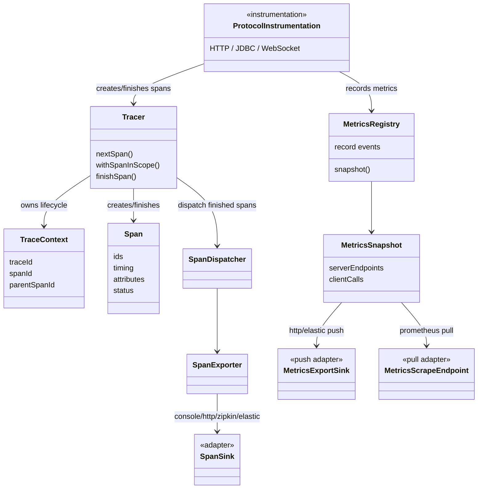

# Mini Distributed Observability

Thư viện Java mini cung cấp observability cho ứng dụng Java với mục tiêu **ít hoặc không cần sửa code nghiệp vụ**. Project tập trung vào ba phần chính: tự động intercept giao tiếp, tạo trace context xuyên suốt request flow, gom metrics nội bộ, rồi xuất dữ liệu ra nhiều backend khác nhau bằng adapter riêng.

Đây không phải một bản thay thế OpenTelemetry/Brave hoàn chỉnh. Mục tiêu của project là chứng minh hướng thiết kế đúng cho đề bài: core độc lập, dữ liệu có cấu trúc, có correlation giữa các service, và có thể nối ra nhiều hệ quan sát khác nhau mà không khóa chặt vào một backend.

## Phạm Vi Đề Bài

- HTTP inbound/outbound: Servlet filter và RestTemplate interceptor.
- Stateful protocol: WebSocket/STOMP qua handshake, channel interceptor và session events.
- Database: JDBC qua datasource-proxy.
- Trace context: tự sinh trace/span id, propagate qua HTTP header, WebSocket/STOMP metadata và thread context.
- Metrics: request/call count, latency percentile, error, in-flight, active connection, throughput bytes, slow request, consecutive failure.
- Output: console, HTTP receiver, Zipkin, Prometheus scrape, Elasticsearch/Kibana.

## Kiến Trúc Tổng Quan



## Trace Context Và Luồng Hoạt Động

Thiết kế trace/span bám theo model quen thuộc của OpenTelemetry và Brave: span có context định danh, được đặt vào current scope khi xử lý, propagate qua biên service, rồi chỉ export khi đã finish.

Trong project này, `Tracer` là lớp điều khiển vòng đời span. `TraceContext` là dữ liệu bất biến để propagate, tương ứng phần cốt lõi của OTel `SpanContext`/Brave `TraceContext`:

- `traceId`: ID chung của toàn bộ request flow, 32 ký tự hex.
- `spanId`: ID của một hop/công việc cụ thể, 16 ký tự hex.
- `parentSpanId`: `spanId` của span cha; root span thì `null`.
- `sampled`: tương ứng sampled flag trong trace flags; quyết định span có được export hay không, nhưng context vẫn được propagate.

Luồng cơ bản:

```text
inbound request
  extract traceparent nếu có
  Tracer.nextSpan(remoteParent) -> server span mới
  Tracer.withSpanInScope(span) -> đưa context vào ThreadLocal + MDC
  xử lý nghiệp vụ / gọi DB / gọi service khác
  Tracer.finishSpan(span) -> chốt duration và dispatch nếu sampled
```

Luồng này gần với Brave: `nextSpan()` lấy current span làm parent nếu có; `withSpanInScope()` chỉ đưa span vào current scope cho downstream code/log MDC nhìn thấy, còn `finishSpan()` là bước kết thúc/export riêng.

Khi tạo span con trong cùng thread, `Tracer.nextSpan()` đọc context hiện tại từ `TraceContextHolder`: span mới giữ nguyên `traceId`, sinh `spanId` mới, và đặt `parentSpanId` bằng span hiện tại. Khi gọi service khác, outbound interceptor inject context hiện tại theo W3C `traceparent`:

```text
00-<traceId>-<spanId>-<flags>
```

Service nhận request extract header đó làm remote parent, rồi tạo server span mới cùng `traceId` và `parentSpanId` trỏ về span upstream. Với WebSocket/STOMP, context lấy từ handshake hoặc native header được giữ trong session/message handling để mỗi message vẫn nối được vào trace.

## Instrumentation Và Output Adapter

Các instrumentation nằm ở biên giao tiếp của ứng dụng:

- `TracingFilter`: nhận HTTP inbound, extract trace context, tạo server span.
- `TracingClientInterceptor`: chặn HTTP outbound, inject trace context.
- `JdbcTracingDataSource`: bọc JDBC call để ghi span và metrics database.
- `StompTracingChannelInterceptor`: tạo span theo từng STOMP message.
- `WebSocketSessionMetricsListener`: đếm active WebSocket connections bằng session lifecycle.

Các output adapter/exporter xuất dữ liệu tách khỏi core:

- Trace export: `SpanExporter` nhận span đã finish và chuyển ra ngoài qua `SpanSink`.
  Các sink hiện có: `ConsoleSpanSink`, `HttpSpanSink`, `ZipkinSpanSink`, `ElasticsearchSpanSink`.
- Metrics push: `MetricsPushExporter` lấy snapshot từ registry và gửi qua `MetricsExportSink`.
  Các sink hiện có: `ConsoleMetricsExportSink`, `HttpMetricsExportSink`, `ElasticsearchMetricsExportSink`.
- Metrics pull: `MetricsScrapeEndpoint` dùng cho hướng backend scrape dữ liệu.
  Endpoint hiện có: `PrometheusMetricsScrapeEndpoint`; phần format text nằm trong `PrometheusTextFormatter`.

Nhờ vậy core không phụ thuộc Prometheus, Zipkin, ELK hay UI tự viết.

## Các Kiểu Output

Project đang có vài kiểu output chính:

- **Console sink**: ghi JSON ra console, phù hợp để debug nhanh.
- **HTTP push sink**: thư viện chủ động gửi `SpanExport` hoặc `MetricsExport` sang receiver tự viết.
- **Backend-specific sink**: sink tự đổi object nội bộ sang format backend cần.
- **Pull endpoint**: dùng cho Prometheus, app mở `/metrics` để Prometheus scrape thay vì thư viện tự push.
- **Receiver UI demo**: server riêng nhận dữ liệu JSON và hiển thị trực quan, dùng để chứng minh output độc lập với backend monitoring cụ thể.

Điểm quan trọng là sink/endpoint chỉ là lớp ngoài. Core không cần biết dữ liệu cuối cùng đi vào Zipkin, Prometheus, ELK hay UI tự viết.

## Ví Dụ Định Dạng Và Liên Kết Span

### 1. Span Trong Một Service Call

Ví dụ service B nhận request từ service A, xử lý `/process`, rồi gọi JDBC trong cùng request:

```text
service-b SERVER  GET /process
  service-b CLIENT  JDBC INSERT
  service-b CLIENT  JDBC SELECT
```

JSON trace export của service B:

```json
{
  "serviceName": "demo-service-b",
  "instanceId": "local-b-1",
  "capturedAtMillis": 1783390655220,
  "spans": [
    {
      "traceId": "a2061e4a49ed0708cfe5f3bf9727b64f",
      "spanId": "b-server",
      "parentSpanId": "a-client",
      "name": "GET /process",
      "kind": "SERVER",
      "startEpochMillis": 1783390655178,
      "startNanos": 4419938123000,
      "durationMillis": 42,
      "status": "OK",
      "sampled": true,
      "attributes": {
        "protocol": "http",
        "http.status_code": "200"
      }
    },
    {
      "traceId": "a2061e4a49ed0708cfe5f3bf9727b64f",
      "spanId": "b-jdbc-insert",
      "parentSpanId": "b-server",
      "name": "JDBC INSERT",
      "kind": "CLIENT",
      "startEpochMillis": 1783390655190,
      "startNanos": 4419950321000,
      "durationMillis": 3,
      "status": "OK",
      "sampled": true,
      "attributes": {
        "protocol": "jdbc",
        "db.operation": "INSERT"
      }
    },
    {
      "traceId": "a2061e4a49ed0708cfe5f3bf9727b64f",
      "spanId": "b-jdbc-select",
      "parentSpanId": "b-server",
      "name": "JDBC SELECT",
      "kind": "CLIENT",
      "startEpochMillis": 1783390655200,
      "startNanos": 4419960100000,
      "durationMillis": 1,
      "status": "OK",
      "sampled": true,
      "attributes": {
        "protocol": "jdbc",
        "db.operation": "SELECT"
      }
    }
  ]
}
```

Quan hệ span:

```text
b-server
  b-jdbc-insert
  b-jdbc-select
```

### 2. Ghép Span Giữa Nhiều Server

Khi service A gọi sang service B, A inject trace context vào request outbound. B extract context đó, nên server span của B trỏ về client span của A:

```text
traceId = a2061e4a49ed0708cfe5f3bf9727b64f

a-server  service-a SERVER  GET /flow
  a-client  service-a CLIENT  GET http://service-b/process
    b-server  service-b SERVER  GET /process
      b-jdbc-insert  service-b CLIENT  JDBC INSERT
      b-jdbc-select  service-b CLIENT  JDBC SELECT
```

Dữ liệu có thể nằm ở nhiều payload riêng:

```json
{
  "serviceName": "demo-service-a",
  "spans": [
    {
      "traceId": "a2061e4a49ed0708cfe5f3bf9727b64f",
      "spanId": "a-server",
      "parentSpanId": null,
      "name": "GET /flow",
      "kind": "SERVER"
    },
    {
      "traceId": "a2061e4a49ed0708cfe5f3bf9727b64f",
      "spanId": "a-client",
      "parentSpanId": "a-server",
      "name": "GET http://service-b/process",
      "kind": "CLIENT"
    }
  ]
}
```

```json
{
  "serviceName": "demo-service-b",
  "spans": [
    {
      "traceId": "a2061e4a49ed0708cfe5f3bf9727b64f",
      "spanId": "b-server",
      "parentSpanId": "a-client",
      "name": "GET /process",
      "kind": "SERVER"
    },
    {
      "traceId": "a2061e4a49ed0708cfe5f3bf9727b64f",
      "spanId": "b-jdbc-select",
      "parentSpanId": "b-server",
      "name": "JDBC SELECT",
      "kind": "CLIENT"
    }
  ]
}
```

Trace được nối bằng `traceId`, `spanId` và `parentSpanId`.

### 3. Metrics JSON Của Cùng Flow

Metrics snapshot của service B:

```json
{
  "serviceName": "demo-service-b",
  "instanceId": "local-b-1",
  "capturedAtMillis": 1783390673139,
  "snapshot": {
    "inFlightRequests": 1,
    "serverEndpoints": {
      "GET /process": {
        "count": 120,
        "errors": 3,
        "slow": 9,
        "totalBytes": 48000,
        "activeConnections": 0,
        "p50Millis": 18,
        "p95Millis": 95,
        "p99Millis": 180
      }
    },
    "clientCalls": {
      "jdbc": {
        "count": 240,
        "errors": 2,
        "slow": 4,
        "totalBytes": 0,
        "activeConnections": 0,
        "p50Millis": 2,
        "p95Millis": 8,
        "p99Millis": 20
      }
    },
    "consecutiveFailures": {
      "jdbc": 0
    }
  }
}
```

## Điểm Mạnh

- Vai trò tương đối rõ: interceptor thu thập, tracer quản lý span lifecycle, registry giữ metrics, sink/endpoint lo xuất dữ liệu.
- Trace và metrics độc lập nhưng cùng dùng dữ liệu từ request flow.
- Có cross-service propagation qua nhiều service demo A -> B -> C.
- Output không bị khóa vào một backend: có thể xem bằng receiver UI, Zipkin, Prometheus/Grafana hoặc Elasticsearch/Kibana.
- Thiết kế đủ nhỏ gọn để đọc và giải thích trong phạm vi mini project.

## Đánh Đổi

- Chưa có retry phức tạp, auth backend, sampling nâng cao hay xử lý concurrency đầy đủ.
- Metrics hiện là snapshot nội bộ, không phải data model đầy đủ như OpenTelemetry Metrics.
- Trace UI/analysis nâng cao vẫn nên để backend chuyên dụng như Zipkin hoặc hệ ELK đảm nhiệm.
- Một số interceptor mới dừng ở case demo phổ biến trên Spring Boot, chưa bao phủ toàn bộ framework Java.
- Các adapter hiện ưu tiên dễ đọc và phục vụ demo, chưa xử lý đầy đủ các tình huống vận hành production.

## Kết Luận

Project đang đi theo hướng phù hợp với đề bài: **core observability độc lập**, dữ liệu có cấu trúc, có trace correlation xuyên service, có metrics tự gom, và có nhiều adapter xuất dữ liệu. Phần cố ý giữ đơn giản nằm ở các chi tiết production như retry, security, schema template, xử lý và tối ưu concurrency.
